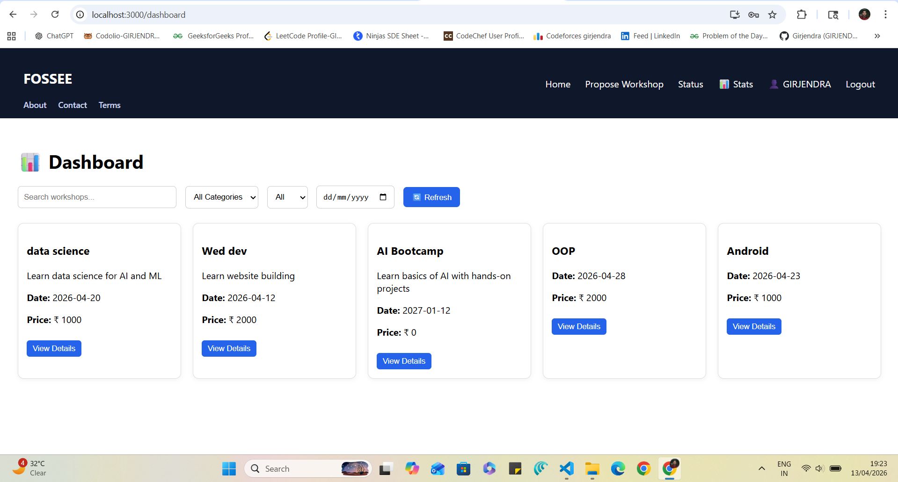
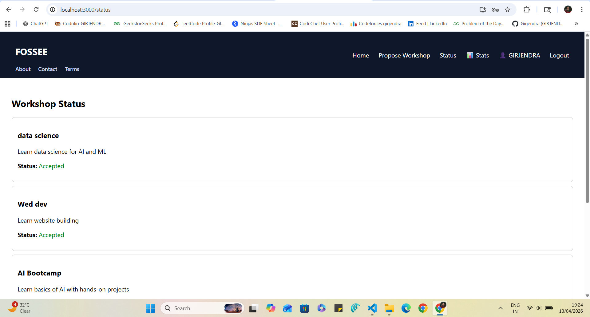
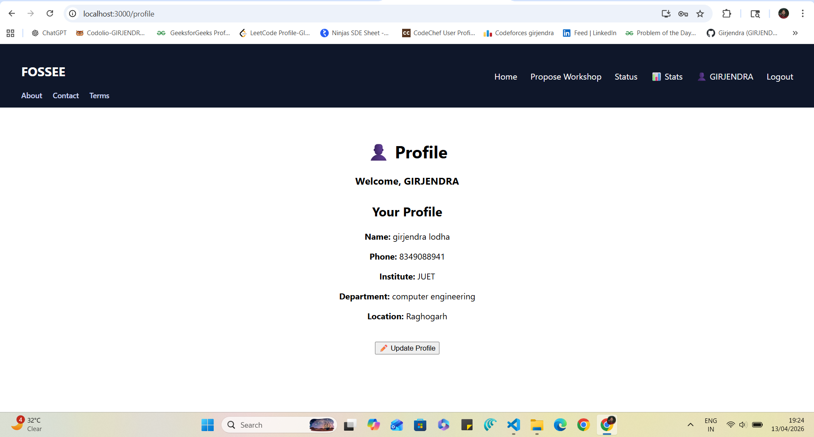
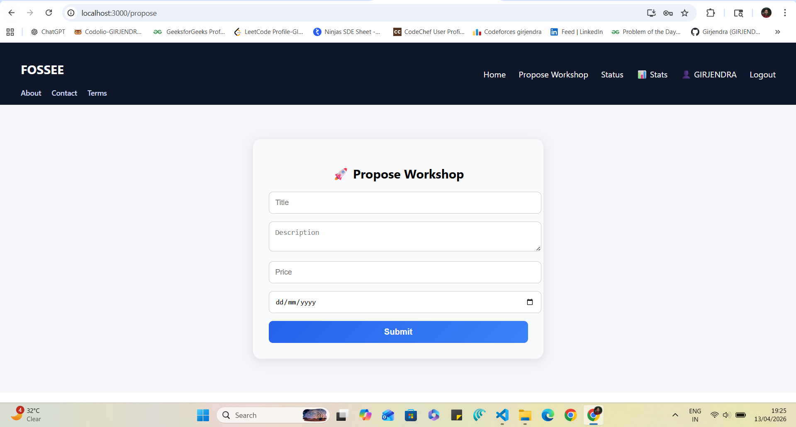
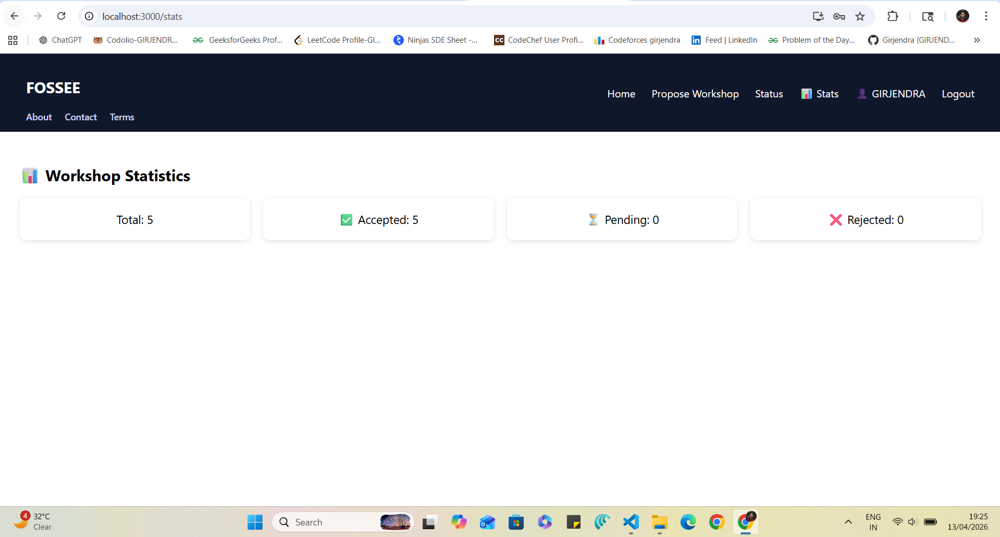
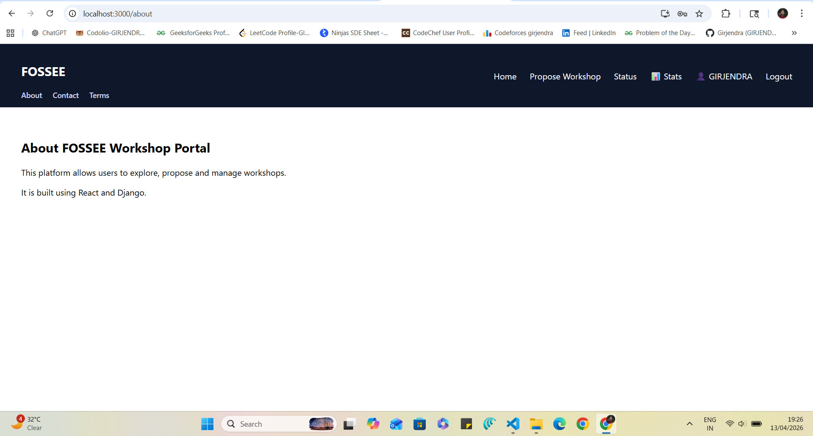

# 🚀 Workshop Booking UI/UX Enhancement

This project focuses on improving the UI/UX of an existing workshop booking system using **React.js** and **Django REST Framework**.

The original system was functional but had a minimal interface and limited usability. The goal of this task was to enhance user experience, improve navigation, and introduce a cleaner, more intuitive design while keeping the core backend structure intact.

Some advanced features such as maps, comments, and instructor-specific analytics were considered out of scope due to time constraints. The primary focus remained on usability, design clarity, and workflow efficiency.

---

## 🎯 Problem Statement

The original workshop booking platform had:
- A basic UI with limited visual structure  
- Poor navigation flow  
- Lack of clear user roles and interaction feedback  

The objective was to redesign the interface to make it more:
- User-friendly  
- Visually structured  
- Responsive across devices  

---

## ✨ Improvements Made

- Redesigned dashboard with improved layout and filtering options  
- Enhanced navigation using a structured and intuitive navbar  
- Implemented role-based access (Admin vs User)  
- Improved workshop details page with complete information display  
- Built a profile management system with update functionality  
- Added workshop approval system (admin-only control)  
- Ensured consistent UI design across all pages  
- Optimized API handling for smoother performance  

---

## ⚙️ Features

- Interactive Dashboard with search and filters  
- Detailed Workshop View Page  
- Workshop Proposal System (User)  
- Admin-based Approval & Rejection System  
- User Profile Creation & Update  
- Workshop Status Tracking  
- Statistics Overview Page  
- Responsive and Clean UI Design  

---

## 👥 User Roles

### 🔹 Admin
- Approve or reject workshop proposals  
- View and manage all workshop statuses  

### 🔹 User
- Propose new workshops  
- View workshop status  
- Manage personal profile  

---

## 🔗 API Integration

- Backend built using **Django REST Framework**  
- Frontend communication handled via **Axios**  
- Efficient handling of asynchronous API calls  
- Clean separation between frontend and backend logic  

---

## 🧠 Reasoning

### 1. Design Principles
- Simplicity and clean interface  
- Consistent UI across all pages  
- Clear visual hierarchy  
- User-friendly navigation  

### 2. Responsiveness
- Flexible layouts using CSS  
- Components designed to adapt to different screen sizes  
- Improved spacing and alignment for mobile devices  

### 3. Trade-offs
- Prioritized UI clarity over heavy animations  
- Used simple styling instead of heavy UI libraries for better performance  

### 4. Challenges
- Implementing role-based access control (Admin vs User)  
- Ensuring seamless frontend-backend API integration  
- Debugging authentication and status update logic  

---

## 🛠️ Tech Stack

- React.js  
- Django REST Framework  
- SQLite  
- Axios  

---

## ⚡ Setup Instructions

### 🔹 Backend

cd workshop_booking
pip install -r requirements.txt
python manage.py runserver

### Frontend

cd frontend
npm install
npm start

---

## 📸 Screenshots

### Dashboard

### Status Page

### Profile Page

### Propose Workshop

### Stats

### About Section

---

## Future Improvements

- Implement authentication using JWT/session-based login
- Add charts and analytics for statistics
- Integrate map-based visualization of workshops
- Improve accessibility and SEO
- Enhance mobile responsiveness further